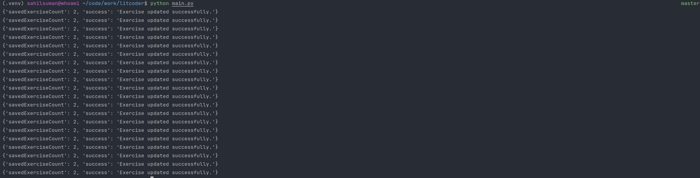

## Litcoder Solution Copy Script

This script automates the retrieval and copying of submitted code from the Litcoder website to another user's account.

## Requirements

### Dependency Installation

Before running the script, ensure you've installed the necessary dependencies using the following command:

\```bash
pip install -r requirements.txt
\```

## Dependencies

The script relies on specific Python packages:

- `selectolax`: An HTML parser
- `httpx`: Enables asynchronous HTTP requests.

## Running the Script

### Adding Valid Credentials

1. In the main.py file, input the account credentials of a user who has completed the Litcoder lab and the credentials of
   the user to whom you intend to copy the lab code.

### Executing the Script

2. Run the script using the following command:

\```bash
python main.py
\```

This action will retrieve all submitted code from the provided credentials and replicate it in your account.

### Output

- Upon successful execution, you will find completed lab assignments in your recent lab section. You can access these
  labs, observe the pre-written solutions, and simply submit your code afterward.

### Working Screenshot


